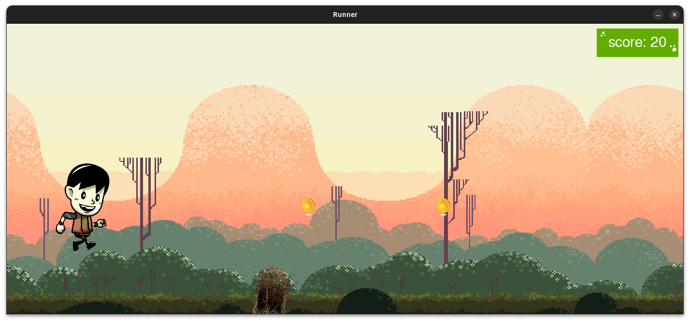

# 🏃‍♂️ Run-Infinity

A fun, side-scrolling endless runner game built with Pygame!

## 🎮 Features

- **Parallax Backgrounds:** Multiple scrolling layers for a smooth visual experience.
- **Animated Player Character:** Frame-by-frame runner animation.
- **Obstacles:** Cactus obstacles that end the game on collision.
- **Collectibles:** Coins to boost your score.
- **Sound Effects & Background Music:** Immersive gameplay with sounds for jumping and background tunes.
- **Score Display:** Tracks your current score.
- **Game Over Screen:** A clear game-over state with restart instructions.

## 📸 Screenshots




## 🛠️ Setup and Installation

1. **Clone this repository:**

   ```bash
   git clone https://github.com/prakashtaz0091/Run-Infinity.git
   cd Run-Infinity
   ```

2. **Install Requirements:**

   ```bash
   pip install -r requirements.txt
   ```

3. **Run the game:**
   ```bash
   python game.py
   ```

## 🎯 How to Play

- **Press SPACE** to jump.
- **Avoid obstacles** (Cacti).
- **Collect coins** for extra points.
- **Press ESC** to quit.

## 📁 Project Structure

```
/Run-Infinity
│
├── assets
│   ├── images
│   ├── music
│   └── runner
│
├── sprites.py
└── game.py
```

## 🔧 Customization

- **Backgrounds:** Swap images in `./assets/images/`.
- **Player Sprite:** Replace runner frames in `./assets/runner/`.
- **Sounds:** Update sound files in `./assets/music/`.
- **Game Speed:** Adjust obstacle velocity in `game.py`.

## 🎉 Future Improvements

- 🔥 Power-ups (Speed boosts, shields).
- 🛠️ Difficulty scaling.
- 🏅 Leaderboard.
- 🎨 Character selection.

## 💙 Credits

- **Code:** code.ing2468@gmail.com.
- **Code Optmization:** ChatGPT
- **Sprites:**

  1. Runner by http://bevouliin.com (Bevouliin)
  2. Coin by <a href="https://www.freepik.com/free-vector/star-coin-gradient-style_59539251.htm#fromView=search&page=1&position=3&uuid=c027d275-568f-4ae6-ad52-71f872ff7051&query=game+coin">Image by juicy_fish on Freepik</a>
  3. Cactus by Jon Sullivan from PDPhoto.org, used from https://opengameart.org/content/cactus-sprite-texture
  4. Game over backgound surface by https://opengameart.org
  5. Hills Pack : Artwork created by Eder Muniz
     Twitter: @EdermuniZz
     Instagram: @edermuniz
     email: edermuniz14@gmail.com

- **Sound Effects:**
  1. https://mixkit.co/free-sound-effects/
  2. Squid Game Music by https://www.youtube.com/@amitvedpathak8

## 🚀 Let’s Run!

Get creative — tweak the game and share your version. 🏁

Happy running! 🎮✨
